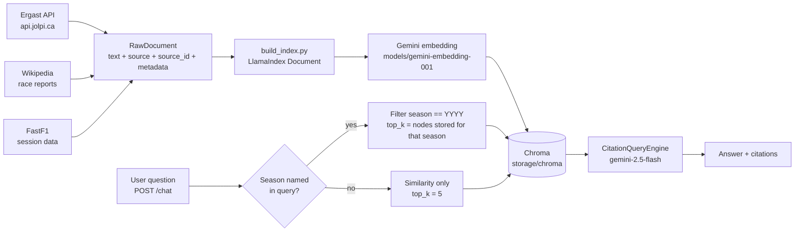

# F1 Trivia RAG

A retrieval-augmented chatbot that answers Formula 1 historical stats and trivia questions, grounded in Ergast race-result data and Wikipedia race reports, with citations back to the source document.


## Why this matters

LLMs are unreliable at precise sports statistics from memory. Asked who finished second at a
particular Grand Prix, or how many races a constructor won in a given season, a model will
usually produce a confident, plausible, and wrong answer — and there is no way for the reader
to tell. Motorsport history is exactly the shape of data that breaks parametric recall: tens of
thousands of near-identical facts (same races, same drivers, different years), rules that change
between eras, and results that get rewritten after the fact by penalties and disqualifications.

This project retrieves the underlying records first and answers only from them, returning the
source document behind each answer so a claim can be checked rather than trusted. The interesting
engineering problem is not "call an LLM" — it is that naive similarity search silently gets
*aggregate* questions wrong. "How many races did Red Bull win in 2023?" needs every race of that
season in context; top-k similarity returns k of them and the model dutifully counts to k. The
retrieval layer here is built specifically around that failure mode (see
[`SeasonAwareRetriever`](src/f1_trivia_rag/rag/query_engine.py)), and the test suite exists to
keep it fixed.

## Skills demonstrated

- **Python 3.11+ packaging** — `src/` layout, `pyproject.toml` with setuptools, editable install,
  `[dev]` optional dependency group.
- **RAG pipeline construction with LlamaIndex** — document normalization, embedding, persistent
  vector indexing, and query-engine assembly.
- **Embeddings and vector search** — Gemini embeddings written into a persistent Chroma
  collection; index reloaded from the vector store rather than rebuilt per query.
- **Retrieval engineering** — a custom `BaseRetriever` subclass that detects a season in the
  query, applies a Chroma metadata filter on `season`, and raises `similarity_top_k` from 5 to
  however many nodes that season actually holds, so aggregate/negation questions see the whole
  season instead of a similarity-ranked slice.
- **Citation-grounded generation** — `CitationQueryEngine` re-chunks retrieved nodes into
  citation-sized spans (512-token chunks, 20-token overlap) and the API surfaces the `source` /
  `source_id` metadata of every supporting node in the response.
- **Metadata modelling for retrieval** — a source-agnostic `RawDocument` dataclass carrying
  `source`, `source_id`, and per-source metadata (season, round, race name), which is what makes
  both filtering and citation possible.
- **Data ingestion from third-party APIs** — paginated/rate-limited REST calls against the
  Ergast successor API, Wikipedia page fetching with disambiguation handling, and FastF1 session
  loading with an on-disk cache.
- **API design with FastAPI + Pydantic** — typed request/response models, lazily initialized
  query engine, `503` when no index has been built yet, health endpoint.
- **Configuration management** — `pydantic-settings` with `.env` loading for API keys, model
  names, and storage paths.
- **Testing an LLM system** — unit tests for pure transforms, plus `live`-marked end-to-end tests
  that build a real throwaway Chroma index per test (isolated temp dir + unique collection name)
  and assert on answers, citations, and the season-aggregate regression. A `pre-commit` hook runs
  ruff and the offline suite before every commit; the live tests are opt-in (`pytest -m live`).
- **Notebook-based experimentation** — `notebooks/rag_experiment.ipynb` runs one real season
  through ingest → index → query and inspects answers alongside their citations.

Not present: no reranking stage, and no offline eval harness or scored benchmark. Chunking is
pinned (a `SentenceSplitter` at 1024/20 configured in `build_index.py`) rather than left to the
library default, but it is not tuned per source.

## Architecture

### Models and stores

| Component | Choice | Configured in |
| --- | --- | --- |
| Embedding model | `models/gemini-embedding-001` (Google Gemini, via `llama-index-embeddings-gemini`) | `gemini_embed_model` |
| Generation model | `gemini-2.5-flash` (Google Gemini, via `llama-index-llms-gemini`) | `gemini_chat_model` |
| Reranker | none | — |
| Vector store | Chroma, `PersistentClient` on local disk | `chroma_persist_dir`, `chroma_collection` (default `f1_trivia`) |
| Orchestration | LlamaIndex `VectorStoreIndex` + `CitationQueryEngine` | `src/f1_trivia_rag/rag/` |
| Serving | FastAPI + Uvicorn | `src/f1_trivia_rag/api/main.py` |

### Data models

- `RawDocument` (`ingestion/common.py`) — the ingestion contract: `text`, `source`
  (`"ergast"` / `"wikipedia"` / `"fastf1"`), `source_id`, and a free-form `metadata` dict. Every
  source normalizes to this, independent of any index library. One key is not free-form:
  `metadata["season"]` is coerced to `str` on construction, because Chroma matches metadata by
  value *and* type, so a source storing `2023` would be invisible to a `season == "2023"` filter.
- LlamaIndex `Document` (`rag/build_index.py`) — `doc_id` is `"{source}:{source_id}"`, and
  `source`/`source_id` are merged into node metadata so retrieval filters and citations both work.
- `ChatRequest` / `ChatResponse` / `Citation` (`api/main.py`) — Pydantic request and response
  schemas; a response carries an `answer` plus a list of `{source, source_id}` citations.

### Component layout

```
src/f1_trivia_rag/
  config.py                 Settings: API key, model names, storage paths (pydantic-settings, .env)
  ingestion/
    common.py               RawDocument dataclass — the normalized ingestion contract
    ergast.py               Season schedule + per-round race results -> RawDocument
    wikipedia_source.py     Race-report prose -> RawDocument
    fastf1_source.py        Session summaries / fastest laps -> RawDocument (2018+, cached)
  rag/
    build_index.py          RawDocument -> LlamaIndex Document -> embedded, persisted Chroma index
    query_engine.py         Loads the persisted index; SeasonAwareRetriever + CitationQueryEngine
  api/
    main.py                 FastAPI app: POST /chat, GET /health
scripts/
  ingest.py                 CLI: fetch seasons from Ergast and (re)build the index
notebooks/
  rag_experiment.ipynb      Single-season ingest -> index -> query walkthrough
tests/
  test_config.py            Settings defaults
  test_ergast_ingestion.py  Ergast payload -> RawDocument transform (no network)
  test_build_index.py       Collection reset + document metadata promotion (no network)
  test_raw_document.py      The season-metadata-is-a-string invariant (no network)
  test_season_aware_retriever.py  Stub-index tests: filter key/value/type and top_k (no network)
  test_e2e.py               Live index build, query engine, and /chat endpoint
  test_chatbot_scenarios.py 15 live scenario tests (aggregation, negation, refusal, citations)
data/                       raw/ and processed/ ingestion output + FastF1 cache (gitignored)
storage/chroma/             persisted Chroma collection (gitignored)
```

### Flow



## How it works

**1. Ingest.** `scripts/ingest.py` takes one or more seasons. For each, `ingestion/ergast.py`
fetches the season schedule from `https://api.jolpi.ca/ergast/f1` (the community-run successor to
the retired ergast.com API), then requests each round's results individually — the API has no
single endpoint returning per-driver detail for a whole season — with a small delay between
requests to stay inside the public rate limits. Each race becomes one `RawDocument`: a header line
(race name, season, circuit, date) followed by one line per classified driver
(`P1: Max Verstappen (Red Bull) - Finished`), tagged with `source="ergast"`,
`source_id="{season}-{round}-result"`, and metadata `{season, round, race_name}`.
`wikipedia_source.py` and `fastf1_source.py` produce the same `RawDocument` shape for narrative
race reports and session-level facts; they are importable modules, and Wikipedia ingestion is not
yet wired into the CLI (the script prints a notice and skips it — the grand-prix names per season
still have to be derived from the schedule).

**2. Index.** `rag/build_index.py` converts each `RawDocument` into a LlamaIndex `Document`
(`doc_id = "{source}:{source_id}"`, source fields promoted into metadata), configures Gemini
embeddings globally, **drops and recreates** the Chroma collection under `storage/chroma`, and
builds a `VectorStoreIndex`, which embeds every node and persists it into Chroma. Because the
store is persistent, this is a one-time cost per corpus rather than per query.

Indexing is a full rebuild, not an append: LlamaIndex mints fresh random node ids each run, so
ingesting into an existing collection would insert a *second* copy of every race and double the
answer to every count question. Ingest is therefore destructive — whatever you pass to
`scripts/ingest.py` becomes the whole corpus.

**3. Retrieve.** `rag/query_engine.py` reloads the index from the existing Chroma collection
(`VectorStoreIndex.from_vector_store`) — no re-embedding of the corpus. Retrieval goes through
`SeasonAwareRetriever`, which regex-matches a four-digit season (1950–2099) in the question:

- **Season named** → retrieve with a metadata filter `season == "YYYY"` and a `similarity_top_k`
  read from the store: the retriever counts how many nodes carry that season and asks for exactly
  that many, so the model sees *every* node of that year. This is what makes counts, "which races
  did X *not* win", and other whole-season aggregates correct. The top_k is derived rather than a
  constant because nothing guarantees one node per race — long Wikipedia reports split into
  several — and a fixed cap would silently truncate the season. `MAX_SEASON_TOP_K` (400) is only
  a ceiling to bound context size; hitting it logs a warning that aggregates may undercount, as
  does retrieving fewer nodes than the store holds.
- **No season named** → plain similarity retrieval with `similarity_top_k=5`, which is the right
  behavior for single-fact lookups.

**4. Generate.** The retrieved nodes are handed to LlamaIndex's `CitationQueryEngine`, which
splits them into numbered citation chunks (512 tokens, 20-token overlap) and prompts
`gemini-2.5-flash` to answer using those numbered sources. The FastAPI `/chat` handler returns the
generated answer plus a `Citation` per supporting node, carrying the `source` and `source_id` of
the document it came from — so every answer points back at the Ergast result or Wikipedia report
that backs it.

## How to run

### Prerequisites

- Python 3.11 or newer
- A Google Gemini API key (used for both embeddings and generation)
- Network access for ingestion (Ergast/jolpica, Wikipedia, FastF1)

### Install

```bash
python -m venv .venv
source .venv/bin/activate     # Windows: .venv\Scripts\activate
pip install -e ".[dev]"
cp .env.example .env          # then fill in GEMINI_API_KEY
```

Optionally enable the pre-commit hook (runs `ruff check` and the offline test suite):

```bash
git config core.hooksPath .githooks
```

### Configuration

Settings are read from `.env` (or real environment variables) by `pydantic-settings`:

| Variable | Default | Purpose |
| --- | --- | --- |
| `GEMINI_API_KEY` | *(empty)* | Google Gemini API key. Required — live tests skip without it, and ingest/query fail without it. |
| `GEMINI_EMBED_MODEL` | `models/gemini-embedding-001` | Embedding model |
| `GEMINI_CHAT_MODEL` | `gemini-2.5-flash` | Generation model |
| `CHROMA_PERSIST_DIR` | `<repo>/storage/chroma` | Chroma persistence directory |
| `CHROMA_COLLECTION` | `f1_trivia` | Chroma collection name |
| `DATA_RAW_DIR` | `<repo>/data/raw` | Raw ingestion output / FastF1 cache |
| `DATA_PROCESSED_DIR` | `<repo>/data/processed` | Processed ingestion output |

### Ingest and build the index

```bash
python scripts/ingest.py --seasons 2018 2019 2020 2021 2022 2023
```

Add `--skip-wikipedia` to state explicitly that only Ergast results are wanted. (Wikipedia
ingestion is skipped either way until per-season grand-prix names are wired up.)

### Serve and query

```bash
uvicorn f1_trivia_rag.api.main:app --reload
```

```bash
curl -X POST http://localhost:8000/chat \
  -H "Content-Type: application/json" \
  -d '{"message": "How many races did Red Bull win in 2023?"}'
```

The response is `{"answer": "...", "citations": [{"source": "ergast", "source_id": "2023-1-result"}, ...]}`.
`GET /health` returns `{"status": "ok"}`. If no index has been built yet, `/chat` returns `503`
with a message pointing at `scripts/ingest.py`.

### Tests

```bash
pytest -m "not live"    # offline suite: pure transforms + retrieval logic, no network
pytest -m live          # end-to-end: builds real indexes and calls Gemini (needs GEMINI_API_KEY)
pytest                  # everything
ruff check .
```

Tests that hit the Gemini API are marked `live`. They also skip automatically when
`GEMINI_API_KEY` is unset, so a bare `pytest` on a machine without a key still passes — but
prefer `-m "not live"` when you mean "don't spend money".

### Notebook

```bash
jupyter lab notebooks/rag_experiment.ipynb
```

Ingests the 2023 season, builds the index, and asks a few questions with their citations printed.
